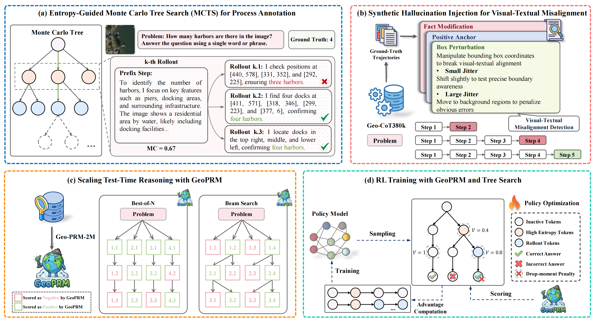

## GeoSolver: Scaling Test-Time Reasoning in Remote Sensing with Fine-Grained Process Supervision
[](https://arxiv.org/abs/2603.09551)
[](https://huggingface.co/minglanga/GeoSolver)

---

## 📢 Latest Updates
- `2026/03/30`: We released **GeoSolver** checkpoint [huggingface](https://huggingface.co/minglanga/GeoSolver). 
- `2026/03/10`: The full version of the paper with the appendix has been uploaded to [ArXiv](https://arxiv.org/abs/2603.09551).

## TODO
- Geo-PRM-2M, the first large-scale, token-level process supervision dataset. 
- GeoPRM, the first token-level process reward model.
- Process-Aware Tree-GRPO, a reinforcement learning algorithm that integrates tree-structured exploration with a faithfulness-weighted reward mechanism to precisely assign credit to intermediate steps.
- TTS implement code. 
---

## Quick Start

### Environment Installation

```bash
conda create -n geosolver python=3.9
conda activate geosolver
pip install -r requirements.txt
```

### Chat with GeoSolver

You can use `GeoSolver_infer_chat.py`, a CLI for chat with GeoSolver.

```bash 
python GeoSolver_infer_chat.py --model_path minglanga/GeoSolver --image_path /path/to/image_path
```


## GeoSolver

### Introduce
**GeoSolver** advances the field of remote sensing interpretation by transitioning toward verifiable, process-supervised reinforcement learning. While recent Vision-Language Models (VLMs) leveraging Chain-of-Thought (CoT) reasoning have shown promise, ensuring the visual faithfulness of intermediate steps remains a critical bottleneck. 

To address this challenge, GeoSolver introduces a novel framework that actively mitigates spatial hallucinations. By integrating **GeoPRM**—a token-level process reward model—with our **Process-Aware Tree-GRPO** alignment algorithm, the model is explicitly incentivized to generate reasoning paths that are not only accurate but consistently verifiable. This process-guided exploration establishes state-of-the-art benchmarks across diverse object-level and scene-level remote sensing tasks, while seamlessly unlocking Test-Time Scaling (TTS) capabilities. 



### Training
The training pipeline of GeoSolver systematically aligns the base Vision-Language Model toward hallucination-free spatial reasoning through three distinct stages:

* **Stage 1: Supervised Fine-Tuning (SFT)**
    We initialize the framework using the pretrained GLM-4.1V-9B-Base checkpoint.  The model undergoes supervised fine-tuning on the Geo-CoT380k dataset to acquire fundamental, perceptually-grounded Chain-of-Thought capabilities. 
* **Stage 2: GeoPRM Construction and Training**
    To provide granular verification signals, we synthesize the **Geo-PRM-2M** dataset. This is achieved through a dual-view pipeline utilizing Entropy-Guided Monte Carlo Tree Search (MCTS) to mine logical uncertainty, and Synthetic Hallucination Injection to explicitly target visual-textual misalignments.  Using this large-scale corpus, we train GeoPRM to function as a highly calibrated token-level verifier. 
* **Stage 3: RL Alignment via Process-Aware Tree-GRPO**
    The final policy is aligned using our novel reinforcement learning algorithm, Process-Aware Tree-GRPO. Instead of sample-inefficient linear rollouts, this algorithm constructs an entropy-guided reasoning tree during exploration. We apply a faithfulness-weighted reward mechanism (drop-moment penalty) to penalize trajectories with sudden PRM confidence drops, effectively resolving the credit assignment problem and avoiding reward hacking. 


## Citation

```bibtex
@misc{sun2026geosolverscalingtesttimereasoning,
      title={GeoSolver: Scaling Test-Time Reasoning in Remote Sensing with Fine-Grained Process Supervision}, 
      author={Lang Sun and Ronghao Fu and Zhuoran Duan and Haoran Liu and Xueyan Liu and Bo Yang},
      year={2026},
      eprint={2603.09551},
      archivePrefix={arXiv},
      primaryClass={cs.CV},
      url={https://arxiv.org/abs/2603.09551}, 
}
```

## Acknowledgement

The initial weights of **GeoSolver** are initialized from [GLM-4.1V-9B-Base](https://github.com/zai-org/GLM-V), a general-domain pre-trained model. 
The training code of **GeoSolver** benefits from [LLaMA-Factory](https://github.com/hiyouga/LLaMA-Factory), [veRL](https://github.com/volcengine/verl), [EasyR1](https://github.com/hiyouga/EasyR1) and [TreeRL](https://github.com/THUDM/TreeRL). 
We sincerely thank their wonderful open-source works.
